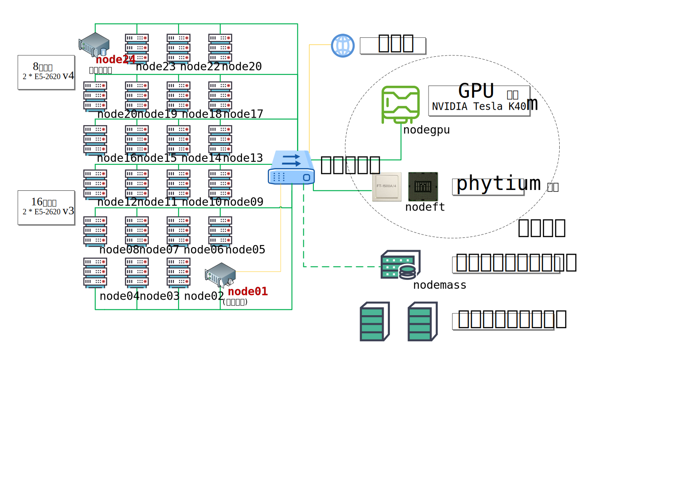

# 集群环境
北京科技大学高性能计算与数据工程实验室（High Performance Computing and Data Engineer Lab,HPC&DE Labs）集群环境，在2016年7月-10月份从旧系统升级到新系统，新集群于10月份正式投入使用。2018年1月份又新增多个计算节点(node17~node24)、GPU节点、飞腾节点和存储节点。2019年初搭建了集群系统，正在逐步完善中。该集群提供给实验室内的各位老师、研究生与本科生使用，目前不对外开放。

## 节点概况
该集群系统共有24个CPU计算节点，命名为**node[01-24]**。每节点2个 Intel Xeon 处理器，但node[01-16]与node[17-24]的处理型号不同。其中，node01是登录节点、NIS主节点、SLURM主节点；node24是SLURM数据库节点；其他节点均为计算节点。每一个节点都有两个以太网卡(eth0与eth1)，其中node02-node24仅用了其中一个网卡连入以太网，node01用了两个网卡：一个连入以太网(eth0)，一个接入外部互联网络(eth1)。node[01-24]通过以太网相连，各节点的内网ip地址分别为172.16.0.1/12, …, 172.16.0.24/12。node01配置了NAT和IP转发，其他节点均可通过node01连接到外部互联网络。

GPU节点采用一块NVIDIA Tesla K40m GPU, 安装有CUDA, tensorflow等环境, 可满足高性能计算和深度学习等需求。

飞腾节点采用国产飞腾CPU —— FT-1500A (arm v8 指令集)。

## 操作系统
node[01-24]均为 CentOS 7.6.1810。内核版本为 3.10.0-957.5.1.el7.x86_64。

GPU计算节点为 CentOS 7.4.1810,x64。

飞腾节点为麒麟操作系统。

## 集群配置


### 节点信息

集群只包含了部分机器，仍有许多机器是由使用人员远程登陆使用的。以下列出集群中已经包括和预计要包括的所有机器。

| 节点分区     | 节点                         | 数量 | 处理器型号                                                   | 超线程 | CPUs | 内存   | 说明        |
| ------------ | ---------------------------- | :--: | ------------------------------------------------------------ | ------ | ---- | ------ | ----------- |
| 登陆         | node01                       |  1   | 2 * E5-2620 v3, 2.40 GHz, 6 cores                            | ✓      | 24   | 64 GiB | 登陆节点    |
| **Vhagar**   | node[05-12]                  |  8   | 2 * E5-2620 v3, 2.40 GHz, 6 cores                            | ✓      | 24   | 64 GiB | 2018年机器  |
| **Balerion** | node[17-23]                  |  8   | 2 * E5-2620 v4, 2.10 GHz, 8 cores                            | ✓      | 32   | 64 GiB | 只开放21-23 |
| **Viserion** | nodeft                       |  1   | 4 * Phytium FT1500a, 1.8 GHz, 4 cores                        | ✗      | 16   | 32 GiB | 未开放      |
| **Drogon**   | nodegpu                      |  1   | 1 * E5-2620 v4, 2.10 GHz, 8 cores<br />1 * NVIDIA Tesla K40m | ✓      | 32   | 16 GiB | 未开放      |
| 数据库       | node24                       |  8   | 2 * E5-2620 v4, 2.10 GHz, 8 cores                            | ✓      | 32   | 64 GiB | 管理员使用  |
| 其他         | node[02-04]<br />node[13-16] |  3   | 2 * E5-2620 v3, 2.40 GHz, 6 cores                            | ✓      | 24   | 64 GiB | 单独使用    |

### 存储信息

假定用户名为`user`

`/home/user`：用户家目录，目前是`node01`的本地存储，速度更快，但空间已经不太多了；

`/data/user`：共享数据目录，使用 NFS，速度慢。这个目录的空间更大，今后还会扩展。

> 注：使用集群节点运行程序时，可以将程序放在`/home/user`或`/data/user`目录下。

## 可用的软件

| 名称     | 说明          |
| -------- | ------------- |
| 软件管理 | Lmod 7.8      |
| 作业调度 | SLURM 18.08.5 |

所有预装的软件都可以用命令查看：

```
$ module spider
```

或

```
$ module spider <TAB><TAB>
```

常用软件列表见附录。

集群配置图如下：

