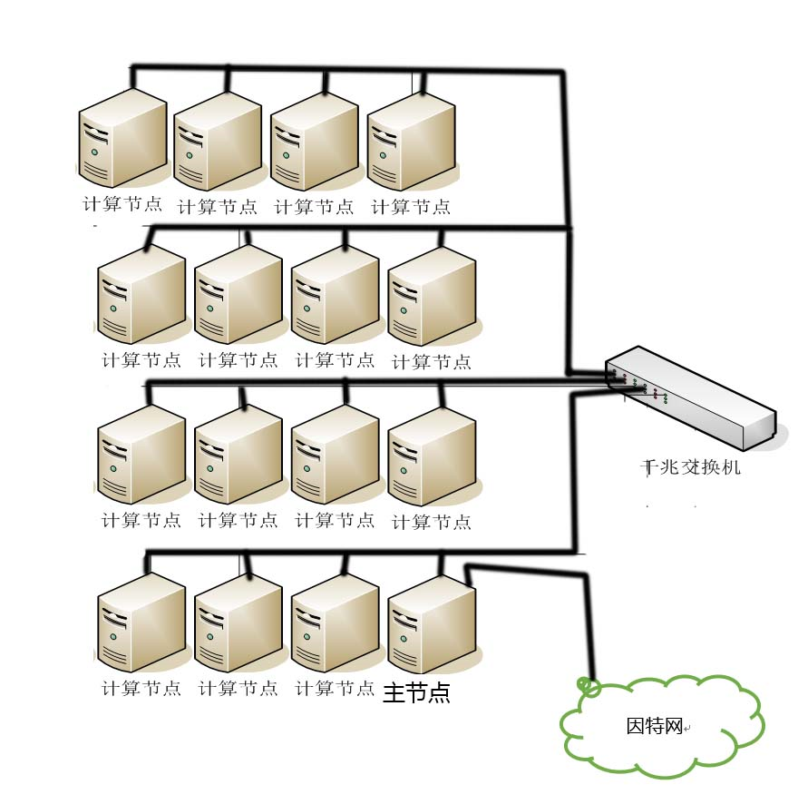
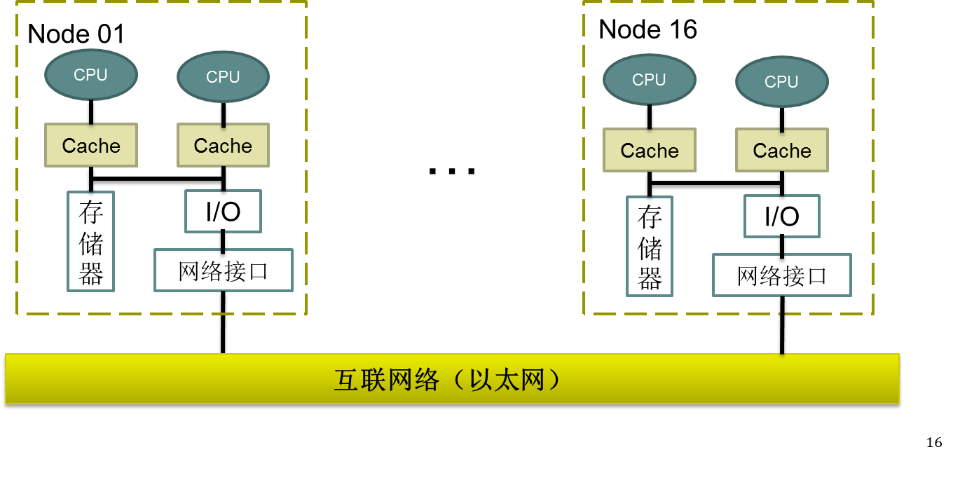

# 1.集群系统架构
北京科技大学高性能计算与数据工程实验室（High Performance Computing and Data Engineer Lab,HPC&DE Labs）集群系统，在2016年7月-10月份从旧系统升级到新系统，新集群于10月份正式投入使用。截止目前(2017.03)系统仍在不断完善中。  
## 节点概况
该集群系统共有16个节点，每个节点2个CPU（Intel(R) Xeon(R) CPU E5-2620 v3 @ 2.40GHz [详细信息](http://www.intel.cn/content/www/cn/zh/products/processors/xeon/e5-processors/e5-2620-v3.html)），每个CPU含有6个核心，每个核心可开启2个超线程(节点概况如下图)。即一个节点的最大并行度为24。

16个节点依次命名为node01、node02、....、node16。其中node01节点是一个特殊节点，它是主节点与登录节点;其他节点为计算节点。每一个节点都有两个以太网卡(eth0与eth1)，其中node2-node16仅用了其中一个网卡(eth1)连入以太网，node01用了两个网卡（一个连入以太网(eth1)，一个接入外部互联网络(eth0)）。node01-node16节点的内部通过以太网相连，各节点的内网ip地址分别为192.168.1.201,…, 192.168.1.216。由于给node01的eth0网卡配置了外网ip,可以用于连接到互联网络,同时用户登录操作也在node01上完成，即为登录节点。

## 操作系统
操作系统：主节点:CentOS 7.4.1708,x64; 计算节点:CentOS 6.6,x64

## MPI版本
本集群上安装有多个版本MPI,具体参照**module工具使用及常用软件**章节