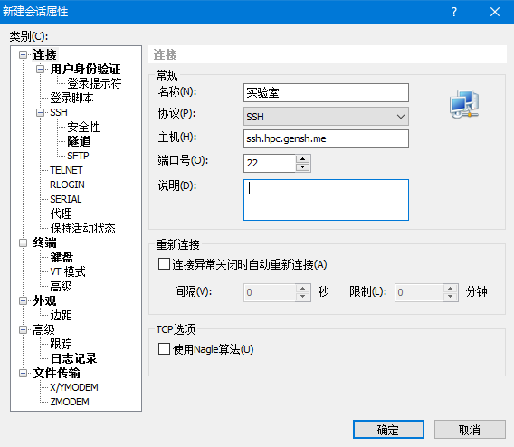
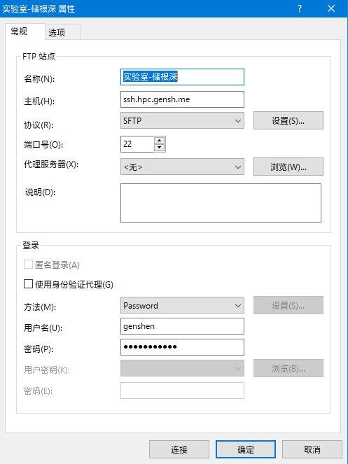

# 登录

## ssh登录集群
目前,该集群仅允许校内的网段登录,不对外网开放直接登录权限。
- ssh登录工具  
  - [Xshell 5](http://www.netsarang.com/products/)(推荐);
  - [putty](http://www.putty.org/)工具;  
  - web登录: [http://console.hpc.gensh.me](http://console.hpc.gensh.me),适用于在未安装ssh工具的系统上登录。  
  - 如果你使用的是linux系统或Mac OS X系统,也可以使用系统内置的ssh命令连接;

  **说明**:  
  1. 如果使用Xshell工具,可以下载Xmanager Enterprise 5,包含了Xshell,Xftp, Xlpd;  
  2. putty 工具推荐使用官方英文版本,某些汉化版本可能隐藏有后门;  
  3. Web登录方式可参考**集群外网VPN登录**章节的关于其登录方式的介绍；  

- ssh登录地址及端口  
登录地址为[ssh.hpc.gensh.me](ssh.hpc.gensh.me)或[n.hpcone.science](n.hpcone.science)，登录端口**22**。  

- Xshell登录集群示例  
以xshell为例，在xshell中选择文件->新建，在类别连接中填入主机名、端口号等内容，再在左侧的连接->用户身份认证，填入自己的用户名和密码(初始密码为123456).

  

## 使用sftp上传文件  
如果需要上传文件到集群的对应的用户目录，可使用支持sftp协议的工具上传。这里推荐使用Xftp工具，具体配置方法和Xshell类似，其中主机名和端口号同ssh登录的设置，协议选择**sftp**。 登录示例参考下图:
  

## 关于集群账号  
账号使用过程中有任何问题或申请开通账号请联系管理员:[wangan](mailto:wangan93@126.com) 或 [genshen](mailto:genshenchu@gmail.com)
