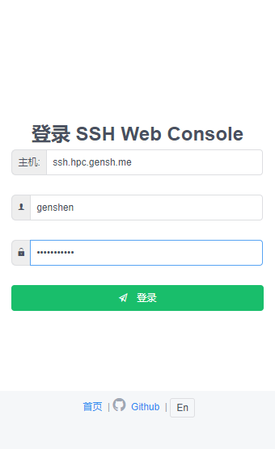
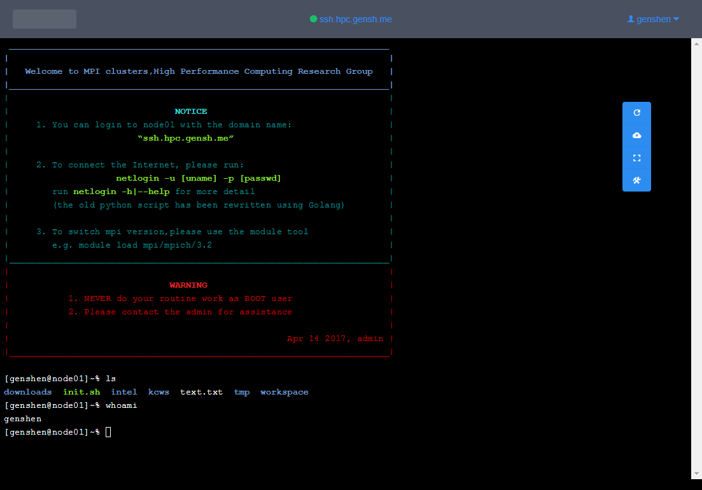
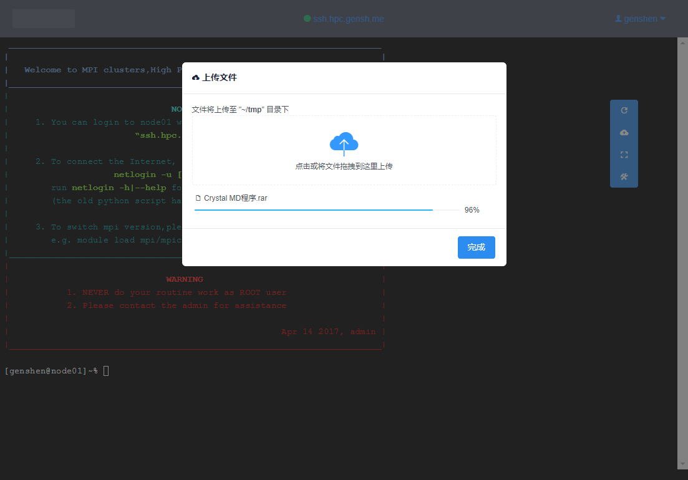

# 外网VPN登录

## 外网VPN登录步骤
目前，在外网环境下(指校外网络环境),无法直接登录该集群.但可以通过VPN的方式在外网登录.登录方式如下：
- 登录VPN  
在浏览器输入https://vpn3.ustb.edu.cn ,进行VPN登录(账号及密码分别为校园网用户名与密码).  
登录VPN完成后,不要关闭该浏览器标签页.

- 登录集群  
 输入以下链接:https://vpn3.ustb.edu.cn/vpn,DanaInfo=console.hpc.gensh.me 即可进入集群SSH Web Console.  
 进入集群SSH Web Console的登录页面后,填入登录地址及端口与用户名,密码后即可登录集群. 
 

- 主要功能  
 该SSH Web Console目前的主要功能包括shell与文件上传功能.
 
 

- 关于该项目(console.hpc.gensh.me )  
  该项目代码仓库在github: [genshen/sshWebConsole](https://github.com/genshen/ssh-web-console)上,使用中有任何问题或改进意见,欢迎前来贡献代码或提issues.

 注:该SSH Web Console在校内网也可以访问,地址:https://console.hpc.gensh.me.
